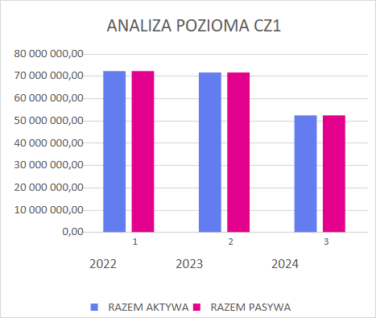
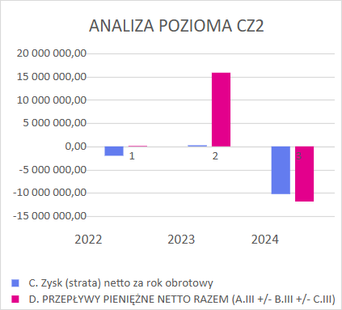
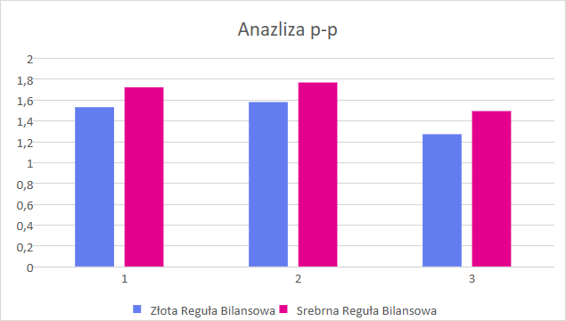
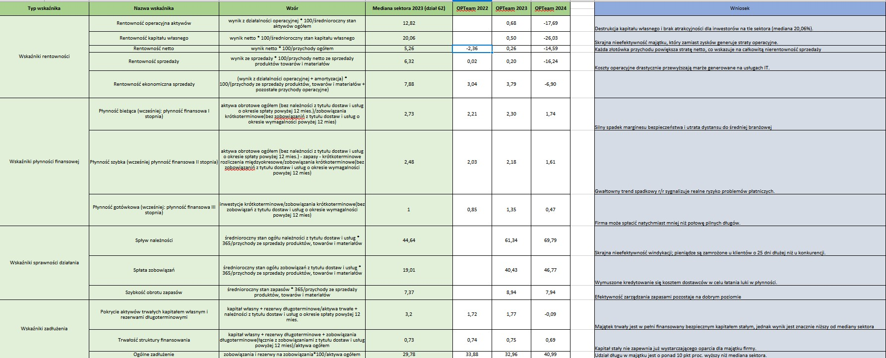
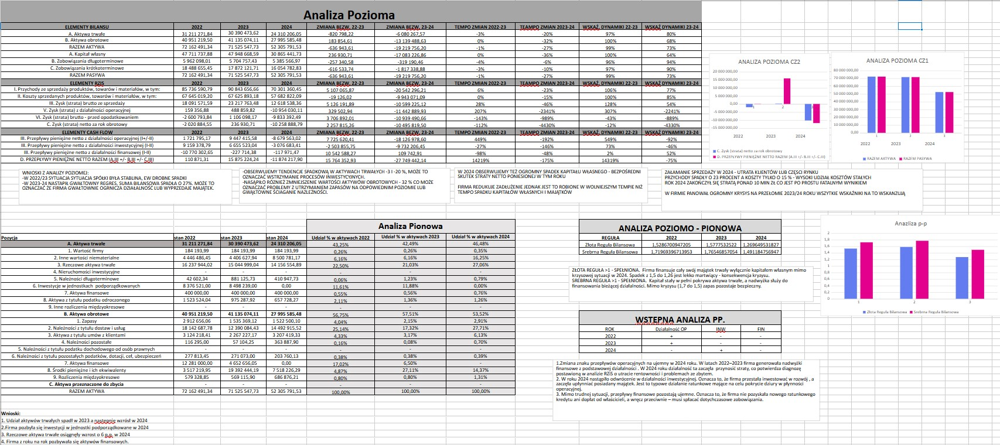
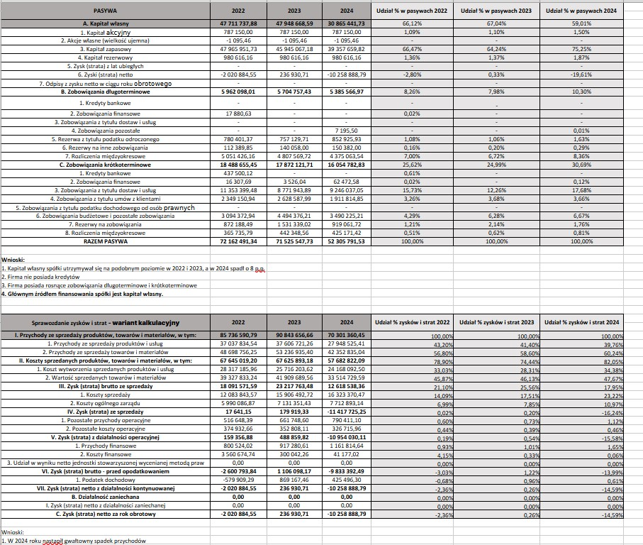

# Financial Analysis of OPTeam S.A. (2022–2024)

## 📌 Project Overview
This repository contains a comprehensive financial analysis of **OPTeam S.A.** covering the fiscal years 2022, 2023, and 2024. The project evaluates the company's financial health, focusing on the significant performance shifts observed in the final year of the analysis.

The analysis focuses on:
* **Horizontal & Vertical Analysis:** Evaluating trends in the Balance Sheet and P&L.
* **Ratio Analysis:** Liquidity, Profitability, Efficiency, and Solvency.
* **Benchmarking:** Comparing results against the IT sector median (Division 62).

---

## 📉 Executive Summary

The data reveals a **critical downturn** in the company's performance in 2024:
1.  **Revenue Collapse:** The company recorded a net loss exceeding **10M PLN**.
2.  **Capital Erosion:** Return on Equity (ROE) dropped drastically to **-26.05%**.
3.  **Asset Contraction:** Total assets decreased by nearly 27% year-over-year, suggesting a scale-down of operations or asset liquidation.
4.  **Stability:** Despite the losses, the company maintains safe liquidity levels and adheres to the Golden Balance Sheet Rule.

---

## 📊 Data Visualization

### 1. Balance Sheet Dynamics (Horizontal Analysis)
The chart below illustrates the significant contraction of the balance sheet in 2024. Both assets and liabilities decreased, reflecting the company's struggle to maintain its scale of operations.

### 2. Net Result vs. Cash Flow
A comparison of the net result against total net cash flows. While 2023 showed positive cash generation (pink bar), 2024 was marked by a deep net loss (blue bar), highlighting a collapse in profitability.

### 3. Financial Stability (Balance Sheet Rules)
Despite the crisis, the financing structure remains conservative:
* **Golden Rule > 1:** Fixed assets are fully financed by equity.
* **Silver Rule > 1:** Long-term capital covers fixed assets with a safety margin.

---

## 🧮 Detailed Analysis Sheets

Below are the full spreadsheets used for calculations and ratio analysis.

### Ratio Analysis (KPIs)
A detailed breakdown of key financial ratios compared to the sector median.
* **Key Insight:** Net Profit Margin fell to **-14.59%**, and the operating cycle has notably worsened.

### Horizontal Analysis & Cash Flow
Detailed numerical data regarding year-over-year changes in the Profit and Loss Statement and Balance Sheet.

### Vertical Analysis & Equity Structure
An assessment of the capital structure. The share of equity in total liabilities dropped from **67% (2023)** to **59% (2024)** due to the retained losses.

---

## 🛠️ Tools Used
* **Microsoft Excel:** Data processing, financial modeling, and visualization.
* **Financial Analysis:** Fundamental analysis techniques and ratio interpretation.
